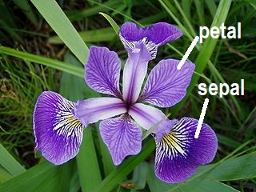
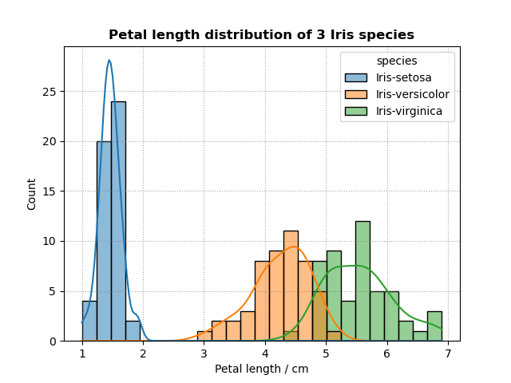
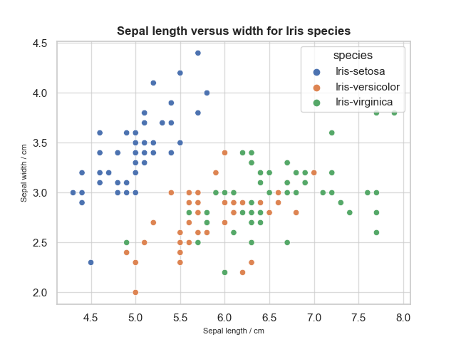
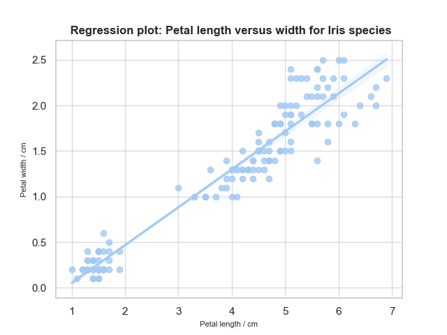
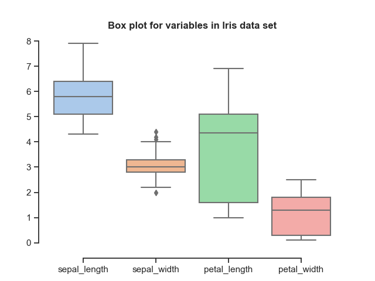

# pands-project
# Project for Programming and Scripting


## Data set
The data set is a collection of measurements of flower parts from 3 different Iris species: *Iris setosa*, *Iris versicolor* and *Iris virginica*. They were collected in the early twentieth century by Edgar Anderson, an American botanist in the Gaspé peninsula of Quebec and used by the British statistician Ronald A. Fisher to demonstrate his linear discriminant analysis method **[1]**.   

Anderson was interested in the evolution and taxonomic origins of various Iris species and Fisher was interested in “linear functions of the measurements by which the populations are best discriminated”.  The hypothesis for examining this dataset originally was that *Iris versicolor* arose from a combination of *Iris virginica* and *Iris setosa*. The Fisher paper considered whether “the mean value for *I. versicolor* takes an intermediate value, and, if so, whether it differs twice as much from *I. setosa* as from *I. virginica*, as might be expected, if the effects of genes are simply additive, in a hybrid between a diploid and a tetraploid species.” **[2]** While this proposal didn’t resolve as neatly as proposed, it has subsequently been proven via molecular and cytogenic tools that *Iris virginica* and *Iris setosa* are the progenitors of *Iris versicolor*.**[3]**   

For this project, the data set is examined to review the data and to establish whether the morphological features can be used to distinguish between the species using quantitative analyses. Plant identification and classification does not rely on flower parts alone as highlighted by Anderson. **[4]** From the perspective of plant breeding for modern agriculture, however, the statistical tools developed by Fisher such as linear regression and ANOVA have been an integral part of the advances in crop breeding.  

This project uses the Fisher Iris flower dataset archived by the UC Irvine Machine Learning Repository and licensed for reuse through CC-BY. **[5]** The original dataset was found to have a number of errors and has been updated by Bezdek *et al*. **[6]** bezdekIris.data was the dataset used for this project. The data has 50 measurements related to petal and sepal size for each species and these are analysed and plotted using the Python programming language. 

  
*Iris versicolor* flower, commonly known as the blue flag Iris. Photo taken by [Danielle Langlois in July 2005](https://commons.wikimedia.org/wiki/File:Iris_versicolor_3.jpg), licenced [CC-BY-SA](https://creativecommons.org/licenses/by-sa/3.0/deed.en)

## How to use
The program analysis.py was created using the Python programming language in Visual Studio and the Anaconda environment. It can be run in a variety of ways depending on your set up. The various methods are outlined [here](https://realpython.com/run-python-scripts/#:~:text=To%20run%20Python%20scripts%20with,python3%20hello.py%20Hello%20World!) 


## Analysis
The program is used to analyse the Iris data set, output data to a text file and generate plots. 

### Import additional modules and libraries
Additional modules and libraries are imported to support [file output](https://docs.python.org/3/library/fileinput.html), [data analysis](https://pandas.pydata.org/), [plotting] (https://matplotlib.org/) and [data visualization](https://seaborn.pydata.org/) in Python. 

```
from fileinput import filename
import pandas as pd
import seaborn as sns
import matplotlib.pyplot as plt
```

### Read in data to a dataframe
Data from the bezdekIris.data file is read into a dataframe and each column is given a variable name. **[7]**
```
filename = 'bezdekIris.data'
df = pd.read_csv(filename, names = ["sepal_length", "sepal_width", "petal_length", "petal_width", "species"])
```

### Data is analysed and output to a text file
The [pandas.DataFrame.describe](https://pandas.pydata.org/docs/reference/api/pandas.DataFrame.describe.html) function, generates descriptive statistics for a dataframe. This was used to generate summary data for each variable, for example, here with sepal length across the 3 Iris species

```
print(df["sepal_length"].describe(), file=f)
````
  
| Summary statistics for Sepal Length  | Value|
| ------------- | ------------- |
|count| 150.000000|
|mean|5.843333|
|std|0.828066|
|min|4.300000|
|25%|5.100000|
|50%|5.800000|
|75%|6.400000|
|max|7.900000|

Count is the number of not empty values. mean is the average sepal length across the 3 species of Iris. std is the standard deviation from this mean. 25%, 50% and 75% are the lower, median and upper percentiles and indicate how many of the values are less than the given percentile. min and max give the minimum and maximum value respectively **[8]** 

The standard deviation is a measure of the amount of variation from the mean of a set of data. The standard deviation is largest for the variable petal length. 

Given the range between minimum and maximum values for these variables, it may be more useful to group them by species.  **[9]** From the tables generated it becomes clear that the *Iris setosa* flowers are smaller than the other two species. 

```
print(df[["sepal_length","species"]].groupby("species").describe(), file=f)
```

| Species | count | mean |std | min | 25% | 50% | 75% | max |
|---|---|---|---|---|---|---|---|---|
|Iris-setosa|50.0 | 5.006 | 0.352490 | 4.3 | 4.800 | 5.0 | 5.2 | 5.8 |
|Iris-versicolor |50.0 | 5.936 | 0.516171 | 4.9 | 5.600 | 5.9 | 6.3 | 7.0|
|Iris-virginica | 50.0 | 6.588 | 0.635880 | 4.9 | 6.225 | 6.5 | 6.9 | 7.9|

The [pandas.DataFrame.corr](https://pandas.pydata.org/pandas-docs/stable/reference/api/pandas.DataFrame.corr.html?msclkid=4d9617becefa11eca3e2b1621b9243d7) function generates a correlation matrix. **[10]**

````
print(df.corr(), file=f)
````

For this data set, there is strong correlation between petal width and petal length compared to a weak inverse correlation between sepal width and sepal length. There is also a strong correlation between sepal length and petal length. **[11]**
  
|---| sepal_length | sepal_width | petal_length | petal_width |
|---|---|---|---|---|
| sepal_length |1.000000 |-0.117570 | 0.871754 | 0.817941 |
| sepal_width  |-0.117570 |1.000000 | -0.428440 |-0.366126 |
| petal_length | 0.871754 |-0.428440 | 1.000000 | 0.962865 |
| petal_width | 0.817941 |-0.366126 | 0.962865 |1.000000 |


## Output summary data to a text file
This summary analysis is output to a text file [summary.txt](Plots/summary.txt) **[12]** **[13]**

```
f = open("summary.txt", "a")

```

## Output data in visual formats using Matplotlib and Seaborn
Matplotlib and Seaborn libraries are useful libraries for data visualization in Python. **[14]** **[15]** 

### Output histograms of each variable
It is often best to visualise a dataset for ease of comprehension. Histograms are plots which represent the distribution of values or the frequency of a value. In this program, histograms are created for each variable and grouped by species so that the species can be appraised against each other. A kernel density estimate is added to smooth the distribution of bars and display on the plot. **[16]**, **[17]**, **[18]**, **[19]**. 

```
plt.rc("grid", linestyle = "dotted", color = "gray", alpha = 0.7) # configure plot appearance, grids, dotted lines, colour of lines and transparency
plt.grid() # set grid lines
ax = sns.histplot(data = df, # take values from data frame
                        x = "sepal_length", # set x-axis values
                         hue = "species", # group by species to give multiple plots on one histogram
                         kde = True, # include KDE analysis
                         bins = 25,  # number of bins
                         element = "bars") # style of histogram bins
ax.set_xlabel("Sepal length / cm", fontsize = 10) # set x-axis label
plt.title("Sepal length distribution of 3 Iris species", weight = "bold") # set plot title
plt.savefig("histogram_sepal_length.png") # save plot
plt.show()
```
With the histograms it is easy to observe that some variables are distinct across species. The petal length and petal width values for *Iris setosa* are discrete from those for *Iris versicolor* and *Iris virginica* whose values overlap. It is also obvious from the histogram that the values for *Iris setosa* don't have much variance.



All final histograms generated from the program are stored in the Plots directory.


### Output scatterplots of each pair of variables
Scatter plots are useful way for to visually examine data for relationships between variables **[20]**. They can be used to visually check for correlations between related variables **[21]**. 

```
sns.scatterplot(x="petal_length", y="petal_width", hue="species", data=df)
plt.title("Petal length versus width for Iris species", weight = "bold")
plt.xlabel("Petal length / cm", fontsize=8)
plt.ylabel("Petal width / cm", fontsize=8)
plt.savefig("scatterplot_petal_length_v_width.png")
plt.show()
```
In this project, scatterplots were used to check for a relationship between petal length versus petal width and sepal length versus sepal width. **[22]** The scatterplot for sepal length versus width doesn't show a strong relationship between these variable across the Iris species. 

 

The final scatterplots are stored in the Plots directory.

## Any other analyses
### Regression plot
The scatterplot for petal length versus width shows correlation in the blobs. Applying a linear regression model to this scatter plot would confirm the visual judgement that there is a strong correlation between petal length and width. Applying the [regplot](https://seaborn.pydata.org/generated/seaborn.regplot.html#seaborn.regplot) function creates a scatter plot with a linear regression model fit **[23]**, **[24]**.

  

### Box plot of Iris dataset
Analysis of any dataset requires initial review of the data which can be acheived with pandas functions or graphically via box plots. Box plots show the distribution of data for a given variable, how symmetrical it is, how tightly grouped and plots outliers. **[]**

```
sns.set_theme(style="ticks", palette="pastel") # configure plot style
sns.boxplot(data=df) # create box plot from dataframe
plt.title("Box plot for variables in Iris data set", weight = "bold") # Title for the plot
sns.despine(offset=10, trim=True) # removes top and right spines from the plot
plt.savefig("boxplot_irisdataset.png") # save plot
plt.show() # show plot
```



## Conclusion
The analyses of the dataset 
- shows that *Iris setosa* can be distinguished from *Iris versicolor* and *Iris virginica* on their petal width and length features in this dataset. In practice, however, petal length and width aren't considered sufficiently reliable on their own. **[4]**. There is sufficiently strong evidence to classify the three species separately based on this data alone. 
- demonstrates a strong correlation between petal length and petal width. One commentator has made the point that this is due to allometric scaling where the size of petals corresponds to the growth of the plant as a whole. **[27]**
- showed a high degree of variance in the petal length variable across the species, a uniform distribution in sepal length and outliers in sepal width. 


Python and its associated libraries offer many possibilites for data analyses and visualisation. While this program looked at a small dataset as a demonstrator, there is great potential for using python for data visualization of much larger datasets in an efficient and hugely customisable way. The derivation of the visualisations is coded and as such is documented which makes them reproducible as necessary. 


## References 
**[1]** Wikipedia (2022) Iris flower data set - Wikipedia. Available at: https://en.wikipedia.org/wiki/Iris_flower_data_set  (Accessed: 30/04/2022)   
**[2]** Fisher, R.A. (1936), The use of multiple measurements in taxonomic problems. Annals of Eugenics, 7: 179-188. https://doi.org/10.1111/j.1469-1809.1936.tb02137.x  
**[3]** Lim KY, Matyasek R, Kovarik A, Leitch A. (2007) Parental origin and genome evolution in the allopolyploid Iris versicolor. Ann Bot.;100(2):219-24. doi: https://doi.org/10.1093/aob/mcm116.  
**[4]** Anderson, E. (1936). The Species Problem in Iris. Annals of the Missouri Botanical Garden, 23(3), 457–509. https://doi.org/10.2307/2394164  
**[5]** Fisher, R.A.. (1988). Iris. UCI Machine Learning Repository. https://archive-beta.ics.uci.edu/ml/datasets/iris   
**[6]** J. C. Bezdek, J. M. Keller, R. Krishnapuram, L. I. Kuncheva and N. R. Pal, "Will the real iris data please stand up?," in IEEE Transactions on Fuzzy Systems, vol. 7, no. 3, pp. 368-369, June 1999, doi: https://doi.org/10.1109/91.771092.  
**[7]** https://www.geeksforgeeks.org/python-basics-of-pandas-using-iris-dataset/  
**[8]** https://www.w3schools.com/python/pandas/ref_df_describe.asp  
**[9]** https://pandas.pydata.org/docs/getting_started/intro_tutorials/06_calculate_statistics.html  
**[10]** https://www.geeksforgeeks.org/how-to-create-a-correlation-matrix-using-pandas/#:~:text=variables%20are%20related.-,Pandas%20dataframe.,na%20values%20are%20automatically%20excluded  
 **[11]** http://www.lac.inpe.br/~rafael.santos/Docs/CAP394/WholeStory-Iris.html#:~:text=The%20Iris%20Dataset%20contains%20four,model%20to%20classify%20the%20species  
**[12]**  https://stackoverflow.com/questions/36571560/directing-print-output-to-a-txt-file  
**[13]** https://stackoverflow.com/questions/2918362/writing-string-to-a-file-on-a-new-line-every-time  
**[14]** https://medium.com/@siddhardhan23/data-visualization-in-python-a90ddb706b23  
**[15]** https://realpython.com/python-histograms/  
**[16]** https://stackoverflow.com/questions/36362624/how-to-plot-multiple-histograms-on-same-plot-with-seaborn  
**[17]** https://seaborn.pydata.org/generated/seaborn.histplot.html#seaborn.histplot  
**[18]** https://stackoverflow.com/questions/1388450/giving-graphs-a-subtitle-in-matplotlib   
**[19]** https://www.geeksforgeeks.org/matplotlib-pyplot-savefig-in-python/   
**[20]** https://greenteapress.com/thinkstats2/html/thinkstats2008.html#sec70  
**[21]** https://visme.co/blog/scatter-plot/  
**[22]** https://www.geeksforgeeks.org/scatterplot-using-seaborn-in-python/  
**[23]** https://seaborn.pydata.org/tutorial/regression.html#regression-tutorial  
**[24]** https://seaborn.pydata.org/generated/seaborn.set_theme.html  
**[25]** https://towardsdatascience.com/understanding-boxplots-5e2df7bcbd51
**[26]** https://seaborn.pydata.org/examples/grouped_boxplot.html  
**[27]** https://armchairecology.blog/iris-dataset/ 
